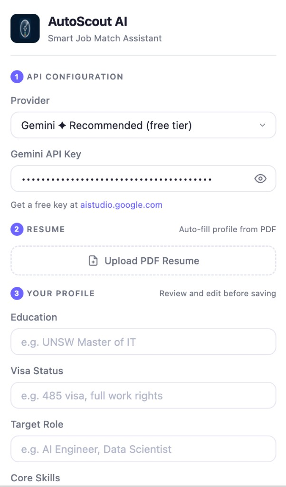
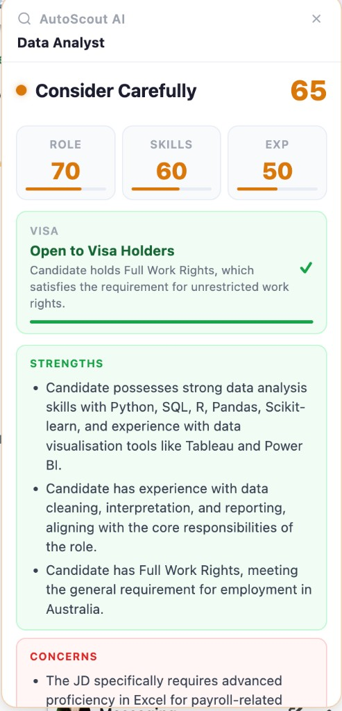

# AutoScout AI

> **Stop reading every job description from start to finish.**  
> AutoScout AI analyses job listings against your personal profile in seconds — right on the page — and tells you whether to apply, what your strengths are, and where the gaps are.

<table>
  <tr>
    <td align="center" width="50%">
      <br/>
      <sub><b>Step-by-step profile setup</b></sub>
    </td>
    <td align="center" width="50%">
      <br/>
      <sub><b>Real-time match card injected on the job page</b></sub>
    </td>
  </tr>
</table>

---

## Features

| Feature | Details |
|---------|---------|
| **Instant job analysis** | Extracts the JD and scores it against your profile in seconds |
| **Multi-dimensional scoring** | Overall match + Role / Skills / Experience sub-scores |
| **Visa eligibility check** | Understands Australian work rights — 485, PR, WHV, student visa, and more |
| **Strengths & Concerns** | Separate green / red boxes with bullet-point analysis |
| **Resume auto-fill** | Upload your PDF and Gemini fills your profile automatically |
| **Multi-language output** | Results in English, 中文, हिन्दी, or 日本語 |
| **Multi-provider LLM** | Gemini (free), OpenAI, Claude, DeepSeek, Qwen, Kimi |
| **Auto / Manual mode** | Analyse every job page automatically, or on-demand only |
| **API key validation** | Key is verified live when you save — instant feedback |
| **Draggable result card** | Reposition the card anywhere on the page; position is remembered |

---

## Supported Sites

| Site | Detection method |
|------|-----------------|
| **Seek** | `/job/` path or `?jobId=` query param |
| **LinkedIn** | `?currentJobId=` query param |
| **Indeed** | `?jk=` query param or `/viewjob` path |
| **Glassdoor** | `/job-listing/`, `/Job/`, `/jobs/` paths |
| **Otta** | `/jobs/` path |
| **Prosple** | `/graduate-jobs/`, `/internships/`, `/jobs/` paths |

> On any other site, a floating **"Analyze this job"** button appears if the page looks like a job listing, so you can trigger analysis manually anywhere.

---

## Installation

### Option A — Chrome Web Store *(coming soon — currently under review)*

Once approved, you will be able to search for **AutoScout AI** on the Chrome Web Store and click **Add to Chrome** — no technical steps required. Check back soon.

---

### Option B — Manual install (available now)

This method takes about 3 minutes and does not require any coding knowledge.

#### 1. Download the extension files

1. Go to the GitHub releases page:  
   **[github.com/EurusNotes/Autoscount_AI](https://github.com/EurusNotes/Autoscount_AI)**
2. Click the green **`<> Code`** button near the top-right of the page
3. Click **`Download ZIP`**
4. A file called `Autoscount_AI-main.zip` will be downloaded to your computer (usually in your `Downloads` folder)

#### 2. Unzip the downloaded file

- **Windows**: Right-click the ZIP file → **Extract All** → click **Extract**
- **Mac**: Double-click the ZIP file — it extracts automatically

You will now have a folder called `Autoscount_AI-main`. Open it and look inside — you should see another folder called **`autoscout-ai`**. This inner folder is the one you need.

#### 3. Open Chrome's extension page

1. Open **Google Chrome** (this extension does not work on Safari, Firefox, or Edge)
2. In the address bar at the top, type the following and press Enter:
   ```
   chrome://extensions
   ```
3. You will see a page titled **"Extensions"**

#### 4. Enable Developer Mode

1. Look at the **top-right corner** of the Extensions page
2. You will see a toggle switch labelled **"Developer mode"**
3. Click it to turn it **ON** — the toggle should turn blue
4. Three new buttons will appear at the top-left: **Load unpacked**, Pack extension, and Update

#### 5. Load the extension

1. Click **"Load unpacked"** (the leftmost of the three new buttons)
2. A file picker window opens
3. Navigate to the `Autoscount_AI-main` folder you unzipped in Step 2
4. Open it and select the **`autoscout-ai`** inner folder (the one that contains `manifest.json`)
5. Click **Select** (Mac) or **Select Folder** (Windows)

> **How do I know I selected the right folder?**  
> The correct folder contains a file called `manifest.json`. If you open it in a text editor it starts with `"manifest_version": 3`.

#### 6. Confirm the extension is installed

1. The Extensions page should now show a card for **AutoScout AI**
2. Go to your Chrome toolbar (top-right of the browser)
3. Click the **puzzle piece icon** 🧩
4. Find **AutoScout AI** in the list and click the **pin icon** 📌 next to it
5. The AutoScout AI icon now appears permanently in your toolbar

> **Important:** After installing, refresh any job-listing tabs that were already open before the extension was installed.

#### Updating the extension in future

When a new version is released on GitHub, repeat Steps 1–5 using the new ZIP. After loading the new folder, click the **circular refresh icon** on the AutoScout AI card on the Extensions page, then refresh any open job tabs.

---

## Setup Guide

### Step 1 — Get an API Key

Click the AutoScout AI icon in your toolbar to open the settings panel.

**Recommended: Gemini (free tier)**

Gemini has a generous free quota — no credit card required.

1. Go to [aistudio.google.com/app/apikey](https://aistudio.google.com/app/apikey)
2. Click **Create API key**
3. Copy the key (starts with `AIza...`)
4. In the popup, make sure **Provider** is set to `Gemini ✦ Recommended`
5. Paste the key into the **API Key** field

> When you save, the extension sends a lightweight test request to verify the key. A green **✓ Valid** badge confirms it worked.

**Using a different provider?**

Select your provider from the dropdown and enter the corresponding key. See the [LLM Provider table](#llm-provider-support) below for links to each provider's key page.

---

### Step 2 — Upload Your Résumé *(optional, Gemini only)*

Uploading your PDF résumé lets Gemini auto-fill your profile — no manual typing needed.

1. Make sure your Gemini API key is entered (Step 1)
2. Click **Upload PDF Resume** or drag-and-drop your PDF
3. Wait a few seconds while Gemini extracts your details
4. Review the filled fields and correct anything if needed

> PDF parsing only works with the Gemini provider. If you are using OpenAI, Claude, or another provider, fill your profile fields manually.

---

### Step 3 — Fill In Your Profile

Review and edit the following fields before saving:

| Field | What to enter | Example |
|-------|--------------|---------|
| **Result Language** | Language for the analysis output | English / 中文 / हिन्दी / 日本語 |
| **Education** | Your highest degree and institution | `Master of IT, University of Melbourne` |
| **Visa Status** | Your current visa and work rights | `Subclass 485, full work rights` |
| **Target Role** | The type of job you are looking for | `Software Engineer, Data Analyst` |
| **Core Skills** | Key technical skills, comma-separated | `Python, SQL, React, AWS` |
| **Years of Experience** | Your experience level | `1–2 years` or `Graduate` |
| **Work & Project History** | Brief summary of past roles and notable projects (max 400 chars sent to LLM) | `1 yr ML Engineer at Acme. Built LLM-based code reviewer for final year project.` |

Click **Save Profile** when done. The extension validates your API key (if it is new) and then saves everything locally on your device.

---

### Step 4 — Choose Auto or Manual Mode

At the bottom of the popup, toggle the analysis mode:

| Mode | Behaviour |
|------|-----------|
| **Auto** | Automatically analyses every job page you open — no clicks needed |
| **Manual** | A green "Analyze this job" button appears; you decide when to trigger analysis |

> **Tip:** Use Manual mode if you want to control API usage. Auto mode is best when you are doing a bulk job search session.

---

## Using the Extension

### Automatic analysis (Auto mode)

1. Open any supported job listing (e.g. a Seek or LinkedIn job page)
2. The result card appears automatically within a few seconds
3. Read the analysis, then move on to the next listing

### Manual analysis (Manual mode)

1. Open a job listing
2. Click the green **"Analyze this job"** button (top-right corner of the page)
3. Wait for the card to appear — a live timer shows elapsed seconds
4. If the analysis takes longer than 15 seconds, a "Taking longer than usual" message appears

### Reading the result card

```
┌─────────────────────────────────────┐
│ ████  AutoScout AI          [close] │  ← Status colour bar (green/orange/red)
│ Research Analyst – Early Careers    │  ← Job title
├─────────────────────────────────────┤
│  ● Strong Match               82    │  ← Verdict + overall score
│  ████████████████░░░░░░░░░░░░       │  ← Animated score bar
│  ┌──────┐ ┌────────┐ ┌──────┐      │
│  │Role  │ │Skills  │ │Exp   │      │  ← Sub-score tiles
│  │  85  │ │  80    │ │  75  │      │
│  └──────┘ └────────┘ └──────┘      │
│  ┌─────────────────────────────┐    │
│  │ VISA  Open to Visa Holders ✓│    │  ← Visa eligibility tile
│  └─────────────────────────────┘    │
│  ┌─────────────────────────────┐    │
│  │ STRENGTHS                   │    │  ← Green box
│  │ • Strong Python and ML fit  │    │
│  │ • Grad-level role matches   │    │
│  └─────────────────────────────┘    │
│  ┌─────────────────────────────┐    │
│  │ CONCERNS                    │    │  ← Red box
│  │ • No Excel experience shown │    │
│  └─────────────────────────────┘    │
└─────────────────────────────────────┘
```

**Score interpretation:**

| Score | Verdict | Meaning |
|-------|---------|---------|
| 75–100 | Strong Match | Well aligned — worth applying |
| 50–74 | Consider Carefully | Partial fit — review the concerns |
| 0–49 | Not a Good Fit | Significant gaps — consider skipping |

**Visa tile:**

| Colour | Meaning |
|--------|---------|
| Green ✓ | Role is open to your visa type |
| Red ✗ | Role requires PR / Australian Citizen, or security clearance |

> The extension understands full work rights (PR, 485, NZ Citizen, partner visa), limited rights (student visa, WHV), and restricted roles (citizen-only, security clearance required).

### Moving the card

Click and drag the card header to reposition it anywhere on the screen. The position is remembered for that browsing session.

### Closing the card

Click the **×** button in the top-right corner of the card. The "Analyze this job" button reappears so you can re-analyse at any time.

---

## LLM Provider Support

| Provider | Model | Free tier | PDF résumé parsing | Get key |
|----------|-------|-----------|-------------------|---------|
| **Gemini ✦ Recommended** | `gemini-2.5-flash-lite` | ✅ Yes | ✅ Yes | [aistudio.google.com](https://aistudio.google.com/app/apikey) |
| OpenAI | `gpt-4o-mini` | ❌ | ❌ | [platform.openai.com](https://platform.openai.com/api-keys) |
| Claude (Anthropic) | `claude-3-5-haiku` | ❌ | ❌ | [console.anthropic.com](https://console.anthropic.com/) |
| DeepSeek | `deepseek-chat` | ❌ | ❌ | [platform.deepseek.com](https://platform.deepseek.com/) |
| Qwen (Alibaba) | `qwen-plus` | ❌ | ❌ | [dashscope.console.aliyun.com](https://dashscope.console.aliyun.com/) |
| Kimi (Moonshot) | `moonshot-v1-8k` | ❌ | ❌ | [platform.moonshot.cn](https://platform.moonshot.cn/) |

---

## Frequently Asked Questions

**Q: Is my data safe? Does it get sent anywhere?**  
Your profile and API key are stored **only on your local device** via `chrome.storage.local`. The job description text and your profile are sent to your chosen LLM provider solely to generate the analysis. No data is sent to any other server. No analytics, no tracking.

**Q: Why does it say "Could not extract job description"?**  
Some pages load content dynamically. Try switching to **Manual mode** and clicking the "Analyze this job" button after the page has fully loaded.

**Q: The analysis is slow — is something wrong?**  
A live timer shows how long the analysis is taking. If it exceeds 15 seconds, a notice appears. This is usually caused by the LLM provider being under high load. Try again in a moment, or switch to a different provider.

**Q: My API key shows ✗ Invalid — but I copied it correctly.**  
Double-check that you selected the correct **Provider** in the dropdown. Each provider has a different key format (Gemini starts with `AIza`, OpenAI/DeepSeek start with `sk-`, Claude with `sk-ant-`).

**Q: I updated my profile but the analysis still uses my old information.**  
Click **Save Profile** after editing. Changes are only applied after saving. If the key is unchanged, saving is instant (no re-validation).

**Q: Can I use this on sites other than the supported list?**  
Yes. On any page that looks like a job listing, the "Analyze this job" button appears automatically. You can trigger analysis on any site as long as the job description text is visible on the page.

**Q: Why does the result card not show on Hatch?**  
Hatch opens job listings inside a modal overlay. Clicking the browser toolbar icon causes the modal to close due to focus events. Use the green **"Analyze this job"** button that appears directly on the page instead.

---

## Troubleshooting

| Problem | Solution |
|---------|---------|
| Extension icon not appearing in toolbar | Click the puzzle piece icon → pin AutoScout AI |
| Card does not appear on a job page | Refresh the tab after installing or reloading the extension |
| "Extension was reloaded" error on the card | Refresh the job page — the extension service worker restarted |
| API key keeps showing as invalid | Check that the provider dropdown matches your key type |
| Resume upload button is greyed out | Switch provider to Gemini — PDF parsing requires Gemini |
| Analysis never starts in Auto mode | The page may not be detected as a job listing — click the manual button |

---

## Privacy

- Your API key and profile are stored **locally** via `chrome.storage.local` — never uploaded to any server
- Job description text and your profile are sent to your chosen LLM API **only** to generate the match result
- The result is displayed on-page and is not stored or logged anywhere
- No analytics, no crash reporting, no external servers of our own

---

## Tech Stack

- Chrome Extension Manifest V3
- Google Gemini API (`gemini-2.5-flash-lite`) — default provider
- OpenAI-compatible API format (OpenAI / DeepSeek / Qwen / Kimi)
- Anthropic Messages API (Claude)
- Vanilla JS / CSS — zero runtime dependencies, no build step

---

## Feedback & Bug Reports

Found a bug or have a feature request? Open an issue on GitHub:  
**[github.com/EurusNotes/Autoscount_AI/issues](https://github.com/EurusNotes/Autoscount_AI/issues)**

---

## License

MIT

---

---

# AutoScout AI — 中文说明

> **不用再逐字阅读每一条职位描述。**
> AutoScout AI 在几秒内将职位与你的个人资料进行匹配分析，直接在页面上显示结果——告诉你该不该投，你的优势在哪，差距在哪。

---

## 功能特性

| 功能 | 说明 |
|------|------|
| **即时职位分析** | 自动提取 JD 内容，与你的资料比对，秒出结果 |
| **多维度评分** | 总匹配分 + 职位 / 技能 / 经验三项细分 |
| **签证资格判断** | 自动识别澳大利亚工作权利——485、PR、学生签、WHV 等，citizen-only 职位直接标红 |
| **优势与顾虑** | 绿色优势框 + 红色顾虑框，bullet point 一目了然 |
| **简历自动填写** | 上传 PDF 简历，Gemini 自动填写资料栏，无需手动输入 |
| **多语言输出** | 分析结果支持中文、English、हिन्दी、日本語 |
| **多 LLM 支持** | Gemini（免费）、OpenAI、Claude、DeepSeek、Qwen、Kimi |
| **自动 / 手动模式** | 每个职位页面自动分析，或手动按需触发 |
| **API Key 实时校验** | 保存时自动验证 key 是否有效，即时反馈 |
| **可拖动结果卡片** | 拖到页面任意位置，下次打开记住上次位置 |

---

## 支持的网站

| 网站 | 检测方式 |
|------|---------|
| **Seek** | `/job/` 路径 或 `?jobId=` 参数 |
| **LinkedIn** | `?currentJobId=` 参数 |
| **Indeed** | `?jk=` 参数 或 `/viewjob` 路径 |
| **Glassdoor** | `/job-listing/`、`/Job/`、`/jobs/` 路径 |
| **Otta** | `/jobs/` 路径 |
| **Prosple** | `/graduate-jobs/`、`/internships/`、`/jobs/` 路径 |

> 在其他任意网站上，只要页面看起来像职位详情页，都会出现悬浮的「分析此职位」按钮，可手动触发分析。

---

## 安装方法

### 方式 A — Chrome 应用商店（即将上线，审核中）

审核通过后，在 Chrome 应用商店搜索 **AutoScout AI**，点击「添加到 Chrome」即可，无需任何技术操作。

---

### 方式 B — 手动安装（现在可用）

全程约 3 分钟，不需要任何编程基础。

#### 第一步：下载插件文件

1. 打开 GitHub 页面：
   **[github.com/EurusNotes/Autoscount_AI](https://github.com/EurusNotes/Autoscount_AI)**
2. 点击页面右上角绿色的 **`<> Code`** 按钮
3. 点击 **`Download ZIP`**
4. 文件 `Autoscount_AI-main.zip` 会下载到你的电脑（通常在「下载」文件夹）

#### 第二步：解压缩文件

- **Windows**：右键点击 ZIP 文件 → 选择「全部解压缩」→ 点击「提取」
- **Mac**：双击 ZIP 文件，自动解压

解压后会出现一个名为 `Autoscount_AI-main` 的文件夹。打开它，里面有一个叫 **`autoscout-ai`** 的子文件夹——这才是需要用到的文件夹。

#### 第三步：打开 Chrome 扩展页面

1. 打开 **Google Chrome**（本插件不支持 Safari、Firefox 或 Edge）
2. 在地址栏输入以下内容并按回车：
   ```
   chrome://extensions
   ```
3. 会看到标题为「扩展程序」的页面

#### 第四步：开启开发者模式

1. 找到「扩展程序」页面**右上角**
2. 有一个叫「**开发者模式**」的开关
3. 点击将它**打开**——开关变蓝即为成功
4. 页面左上角会出现三个新按钮：**加载已解压的扩展程序**、打包扩展程序、更新

#### 第五步：加载插件

1. 点击「**加载已解压的扩展程序**」（三个按钮中最左边的那个）
2. 弹出文件选择窗口
3. 找到第二步解压出的 `Autoscount_AI-main` 文件夹
4. 打开它，选中里面的 **`autoscout-ai`** 子文件夹（包含 `manifest.json` 的那个）
5. 点击「**选择**」（Mac）或「**选择文件夹**」（Windows）

> **怎么确认选对了文件夹？**
> 正确的文件夹内有一个名为 `manifest.json` 的文件。

#### 第六步：确认安装成功

1. 扩展程序页面出现 **AutoScout AI** 的卡片，说明安装成功
2. 点击浏览器右上角的**拼图图标** 🧩
3. 找到 **AutoScout AI**，点击旁边的**图钉图标** 📌
4. AutoScout AI 的图标就会固定显示在工具栏中

> **重要：** 安装完成后，请刷新所有已打开的招聘网站标签页。

#### 后续版本更新

GitHub 发布新版本时，重复第一至第五步，用新 ZIP 替换旧文件夹。加载完成后，点击扩展程序页面中 AutoScout AI 卡片上的**刷新图标**，再刷新职位页面即可。

---

## 使用配置

### 第一步：获取 API Key

点击工具栏上的 AutoScout AI 图标，打开配置面板。

**推荐使用 Gemini（有免费额度）**

Gemini 提供免费配额，无需信用卡。

1. 访问 [aistudio.google.com/app/apikey](https://aistudio.google.com/app/apikey)
2. 点击「**Create API key**」
3. 复制生成的 key（以 `AIza` 开头）
4. 在插件弹窗中，确认「Provider」选择的是 `Gemini ✦ Recommended`
5. 将 key 粘贴到「API Key」输入框

> 点击保存时，插件会自动发送一个轻量级请求验证 key 是否有效。旁边出现绿色 **✓ Valid** 即为成功。

---

### 第二步：上传简历（可选，仅限 Gemini）

上传 PDF 简历后，Gemini 会自动填写你的资料栏，无需手动输入。

1. 确保已填写 Gemini API Key（第一步）
2. 点击「**Upload PDF Resume**」或直接拖入 PDF 文件
3. 等待几秒，Gemini 自动提取资料
4. 检查填充的内容，必要时手动修改

> PDF 解析功能仅支持 Gemini 提供商。使用其他提供商时，需手动填写资料。

---

### 第三步：填写个人资料

| 字段 | 填写内容 | 示例 |
|------|---------|------|
| **结果语言** | 分析结果的语言 | 中文 / English / हिन्दी / 日本語 |
| **学历** | 最高学历及院校 | `悉尼大学 信息技术硕士` |
| **签证状态** | 当前签证及工作权利 | `485签证，full work rights` |
| **目标职位** | 求职方向 | `软件工程师、数据分析师` |
| **核心技能** | 关键技术技能，逗号分隔 | `Python, SQL, React, AWS` |
| **工作年限** | 经验水平 | `1–2年` 或 `应届生` |
| **工作与项目经历** | 过往经历和项目简述（最多 400 字符发送给 LLM） | `在 XX 公司做了 1 年 ML 工程师，毕业设计是基于 LLM 的代码审查工具` |

填写完成后点击「**Save Profile**」保存。所有数据仅存储在本地设备，不会上传到任何服务器。

---

### 第四步：选择分析模式

| 模式 | 行为 |
|------|------|
| **Auto（自动）** | 打开每个职位页面自动开始分析，无需任何操作 |
| **Manual（手动）** | 页面出现绿色「分析此职位」按钮，由你决定何时触发 |

> **建议：** 想控制 API 用量时选 Manual；集中刷职位时选 Auto。

---

## 如何阅读分析结果

**分数解读：**

| 分数 | 评级 | 含义 |
|------|------|------|
| 75–100 | 强烈匹配 | 高度契合，值得投递 |
| 50–74 | 谨慎考虑 | 部分匹配，仔细看顾虑栏 |
| 0–49 | 不太匹配 | 差距较大，可考虑跳过 |

**签证格子：**

| 颜色 | 含义 |
|------|------|
| 绿色 ✓ | 该职位对你的签证类型开放 |
| 红色 ✗ | 该职位要求 PR / 澳洲公民，或需要安全许可 |

> 插件能识别澳大利亚各类工作权利：PR、485、新西兰公民、配偶签证（有工作条件）、桥接签证等为完全工作权利；学生签证、打工度假签证为受限工作权利；citizen-only 或需要安全许可的职位会直接标红。

---

## 常见问题

**Q：我的数据安全吗？会上传到哪里吗？**
API Key 和个人资料仅通过 `chrome.storage.local` 存储在本地设备上，不会上传到任何服务器。职位描述文本和你的资料只会发送给你选择的 LLM 提供商用于生成分析，没有其他用途，无任何追踪。

**Q：提示「无法提取职位描述」怎么办？**
部分页面内容是动态加载的。切换到 **Manual 模式**，等页面完全加载后再点击「分析此职位」按钮。

**Q：分析很慢，是出问题了吗？**
卡片上有实时计时器。超过 15 秒会出现提示。通常是 LLM 提供商服务器繁忙，稍后重试或切换提供商即可。

**Q：API Key 显示 ✗ Invalid，但我确认复制对了。**
检查「Provider」下拉框是否与 key 的类型匹配。Gemini 的 key 以 `AIza` 开头，OpenAI/DeepSeek 以 `sk-` 开头，Claude 以 `sk-ant-` 开头。

**Q：更新了资料但分析结果用的还是旧信息。**
编辑完资料后必须点击「**Save Profile**」才会生效。如果 key 没有变化，保存是即时的，不需要重新验证。

**Q：在 Hatch 上为什么点击扩展图标后职位弹窗会关闭？**
Hatch 的职位详情以模态弹窗展示，点击浏览器工具栏会触发失焦事件导致弹窗关闭。请直接点击页面右上角的绿色「**分析此职位**」按钮，不要点工具栏图标。

---

## 常见问题排查

| 问题 | 解决方法 |
|------|---------|
| 工具栏没有看到插件图标 | 点击拼图图标 🧩 → 找到 AutoScout AI → 点图钉固定 |
| 职位页面没有出现卡片 | 安装或重新加载插件后，刷新职位标签页 |
| 卡片显示「扩展已重载」错误 | 刷新职位页面，Service Worker 已自动重启 |
| API Key 一直显示无效 | 检查 Provider 下拉框是否与 key 类型匹配 |
| 简历上传按钮是灰色的 | 切换 Provider 为 Gemini，PDF 解析仅支持 Gemini |
| Auto 模式下从不自动分析 | 该页面可能未被识别为职位页，点击手动按钮触发 |

---

## 隐私说明

- API Key 和个人资料通过 `chrome.storage.local` **仅存储在本地**，不上传到任何服务器
- 职位描述文本和资料**仅发送给你选择的 LLM API** 用于生成匹配结果
- 分析结果只展示在页面上，不存储、不记录
- 无任何数据分析、崩溃上报或我们自己的外部服务器

---

## 反馈与 Bug 报告

发现 bug 或有功能建议？在 GitHub 提 Issue：
**[github.com/EurusNotes/Autoscount_AI/issues](https://github.com/EurusNotes/Autoscount_AI/issues)**
